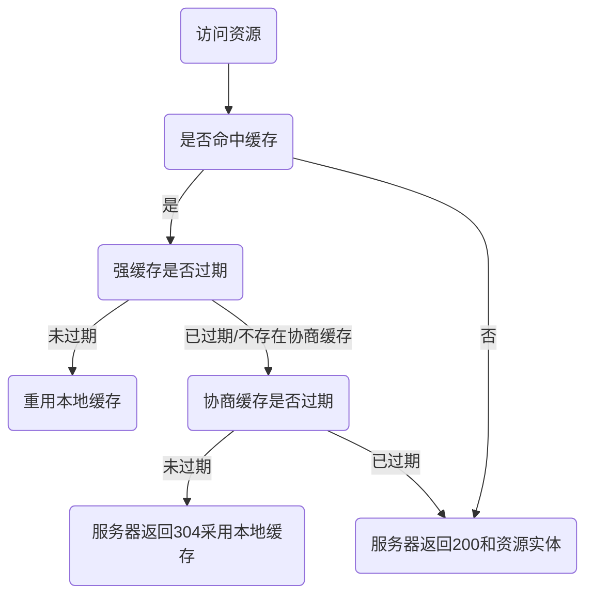

# httpCache
learn http caching

## 1. 前言
公司业务群里经常反馈某个功能突然失效了，前端开发儿回复：清理浏览器缓存，重新访问。客户乖乖地操作后，反馈可以使用了！

我也不清楚到底哪里缓存了，缓存了什么，反正万能的重启/清理缓存真真好使~dog。

今天就一起来扒拉下浏览器缓存究竟怎么回事。

## 2. HTTP缓存标头
浏览器缓存设置需要靠`HTTP`头部控制缓存策略，所以咱们先了解下涉及到的`HTTP`头部。

> 正所谓：“工欲善其事，必先利其器”。

### 2.1 Expires
在`HTTP/1.0`时通过`Expires`头部来告诉浏览器将资源缓存下来。该值是服务端设置的绝对时间，告诉浏览器资源的过期时间，即在xx时间缓存过期，在过期时间内可以采用本地缓存资源，过期后需要重新请求服务器获取资源。

由于`Expires`的值是服务端的绝对时间，若客户端与服务端时间不一致，则会导致资源缓存更新不及时或缓存失效问题。因此在`HTTP1.1`时提出了`Cache-Control: max-age=xx`头部来替代`Expires`。

### 2.2 Cache-Control
在`HTTP/1.1`时通过`Cache-Control`头告诉浏览器采用缓存，而不同的值对应不同的缓存策略，它可以作为请求头和响应头。

| Cache-Control值 | 含义 |
| --- | --- |
| public | 表明响应可以被任何对象（包括：发送请求的客户端，代理服务器，等等）缓存，即使是通常不可缓存的内容（例如：1.该响应没有`max-age`指令或`Expires`消息头；2. 该响应对应的请求方法是 [POST](https://developer.mozilla.org/zh-CN/docs/Web/HTTP/Methods/POST)）
| private | 表明响应只能被单个用户缓存，不能作为共享缓存（即代理服务器不能缓存它）。私有缓存可以缓存响应内容
| no-cache | 在发布缓存副本之前，强制要求缓存把请求提交给原始服务器进行验证 (协商缓存验证)
| no-store | 缓存不应存储有关客户端请求或服务器响应的任何内容，即不使用任何缓存
| max-age=5 | 设置缓存存储的最大周期，超过这个时间缓存被认为过期 (单位秒)。与`Expires`相反，时间是相对于请求的时间
| s-maxage=5 | 覆盖`max-age`或者`Expires`头，但是仅适用于共享缓存 (比如各个代理)，私有缓存会忽略它
| must-revalidate | 一旦资源过期（比如已经超过`max-age`），在成功向原始服务器验证之前，缓存不能用该资源响应后续请求

> Cache-Control的全部值可查看[MDN Cache-Control](https://developer.mozilla.org/zh-CN/docs/Web/HTTP/Headers/Cache-Control)

1. 通过设置`max-age`的值来替代`Expires`，时间是相对于客户端的请求时间，即在xx秒后缓存过期。
2. 这2种缓存策略是属于强缓存，在过期时间内都采用本地缓存，只有当缓存过期后，才重新请求服务器。
3. 如果同时设置了这2个头部字段，会忽略`Expires`。

```javascript
const http = require('http');
const fs = require('fs');
const url = require('url');

http.createServer((req, res) => {
  const {
    pathname
  } = url.parse(req.url)
  if (pathname === '/') {
    const data = fs.readFileSync('./index.html');
    res.end(data);
  } else if (/.*?\.jpe?g/.test(pathname)) {
    res.setHeader('Cache-Control', 'max-age=5');
    const data = fs.readFileSync('./images/02.jpeg');
    res.end(data)
  } else {
    res.end('Not Found')
  }
}).listen(8000, () => {
  console.log('服务已在8000端口启动：localhost:8000')
})
```
在5秒内，刷新浏览器重复访问图片都是复用的本地缓存资源。


5秒后，图片缓存过期，将重新请求服务器，刷新本地缓存。

由于`max-age`值单位是`秒`，若缓存资源在1秒内已更新，则会导致客户端的资源无法及时得到更新，访问的仍是旧版本资源问题，因此提出了协商缓存策略，`Cache-Control: no-cache`表示采用协商缓存，配合一对`Last-Modified`/`If-Modified-Since`头优化此问题。

### 2.3 Last-Modified / If-Modified-Since
服务器通过响应`Last-Modified`头告诉浏览器将资源缓存起来，客户端需要在下一次访问资源时请求服务器，并且带上`If-Modified-Since`请求头信息，问问资源是否过期，由服务器响应通过是否过期，是否需要重新发送资源给客户端。

`Last-Modified`值是资源修改时间，由服务器响应给客户端，下次客户端访问资源时，带上`If-Modified-Since`请求头，值为`Last-Modified`值。服务器收到客户端请求时，校验`If-Modified-Since`值是不是和资源的修改时间值一致。若一致，则表示资源未过期，返回给客户端`304 Not Modified`响应码；若不一致，则表示资源过期，返回更新后的资源给客户端。

```javascript
if (/.*?\.jpe?g/.test(pathname)) {
    // 设置头字段大小写无所谓，浏览器会统一转小写处理，获取头采用全小写
    res.setHeader('Cache-Control', 'no-cache');
    // 获取资源修改时间
    const stat = fs.statSync('./images/02.jpeg');
    // 设置GMT时间格式
    const lastModified = stat.mtime.toUTCString();
    res.setHeader('Last-Modified', lastModified);
    
    // 获取请求头，判断是否和服务器修改时间一致
    const ifModifiedSince = req.headers['if-modified-since'];
    if (ifModifiedSince === lastModified) {
      res.writeHead(304, 'Not Modified');
      res.end();
      return;
    }

    const data = fs.readFileSync('./images/02.jpeg');
    res.end(data)
  }
```
我们可以通过修改图片名来更新修改时间，来验证浏览器是否会重新请求服务器，答案是肯定会重新请求的，因为服务器的`Last-Modified`值已经变更，与客户端的`If-Modified-Since`值已不同。


由于修改资源名字也会刷新资源的修改时间，导致资源实际内容未修改浏览器却要重新获取资源，浪费网络流量等问题，因此提出了`Etag`/`If-None-Match`来优化此问题。

### 2.4 Etag / If-None-Match
服务器通过响应`Etag`头告诉浏览器将资源的指纹信息，客户端需要在下一次访问资源时请求服务器，并且带上`If-None-Match`请求头信息，问问资源是否过期，由服务器响应资源是否过期，是否需要重新发送资源给客户端。

`Etag`值是根据资源的二进制数据计算出来的`hash`值，因此资源有变动则`Etag`值也会更新，由服务器响应给客户端，下次客户端访问资源时，需要带上`If-None-Match`请求头，值为`Etag`值。服务器收到客户端请求时，校验`If-None-Match`请求头的值是不是和服务器上资源的指纹一致。若一致，则表示资源未过期，返回给客户端`304 Not Modified`响应码；若不一致，则表示资源过期，返回更新后的资源给客户端。

```javascript
if (/.*?\.jpe?g/.test(pathname)) {
    res.setHeader('Cache-Control', 'no-cache');
    // 测试使用第3方etag包来计算资源的hash值。其实这里测试，可以手动设置etag值，例如res.setHeader('Etag', ‘1234’);
    const etagContent = etag(data);
    res.setHeader('Etag', etagContent);
    
    const ifNoneMatch = req.headers['if-none-match'];
    if (ifNoneMatch === etagContent) {
      res.writeHead(304, 'Not Modified');
      res.end();
      return;
    }

    const data = fs.readFileSync('./images/02.jpeg');
    res.end(data)
  }
```
第二次访问时，`Etag` / `If-None-Match`值一致，服务器直接返回304，告诉浏览器采用缓存。


如果我们将资源内容进行更改，浏览器再次访问图片时，服务器会重新返回资源，并刷新客户端缓存。

当`Last-Modified`与`Etag`同时存在时，优先采用`Etag`，因为`Etag`判断资源是否过期更精准。

由于`Etag`是根据资源计算而来，如果资源较大，并且每次条件请求时都要计算`Etag`值，也是一个不小的开销，因此我们在实际开发中根据不同资源，设置不同的缓存策略。

## 3. 缓存策略
1. `Cache-Control: max-age=0`; 表示资源立刻过期，效果和设置`no-cache`一，然后采用协商缓存。
2. `Cache-Control: no-cache`; `Last-Modified`与`Etag`同时存在的情况，根据`Etag`优先原则。但是如果服务器没有明确响应缓存方式，则会激活浏览器**启发式缓存**。
3. 若浏览器强制刷新或者在控制台☑️禁用缓存，则浏览器会自动在请求头添加`Cache-Control: no-cache`和`Pragma: no-cache`，表明应向服务器请求资源。
> **`Pragma`** 是一个在 `HTTP/1.0` 中规定的通用首部，这个首部的效果依赖于不同的实现，所以在“请求 - 响应”链中可能会有不同的效果。它用来向后兼容只支持 `HTTP/1.0` 协议的缓存服务器，那时候 `HTTP/1.1` 协议中的 `Cache-Control` 还没有出来。


## 4. 启发式缓存
如果一个可以缓存的请求没有设置`Expires` / `Cache-Control`，但是响应头有设置`Last-Modified`标头，这种情况下浏览器会有一个默认的缓存策略：`(当前时间 - Last-Modified)*0.1`，在此期间浏览器会一直重用本地缓存，这就是**启发式缓存**。


启发式缓存是在`Cache-Control`被广泛采用之前出现的一种解决方法，基本上所有响应都应明确指定`Cache-Control`标头。否则会导致客户端在一定时间内采用本地缓存，而服务器无计可施，只能要求客户手动清理浏览器缓存或者等待缓存过期。

## 5. 最佳实践
使用前端框架开发的项目，默认打包项目生成的js，css等资源文件，在每次打包时会计算hash值作为文件名，像这种我们可以确定的资源可以设置一个较长时间的强缓存，毕竟每次打包后文件名不一致客户端会当作新资源请求服务器，可以避免协商缓存请求服务器的步骤。

## 6. 缓存流程图

